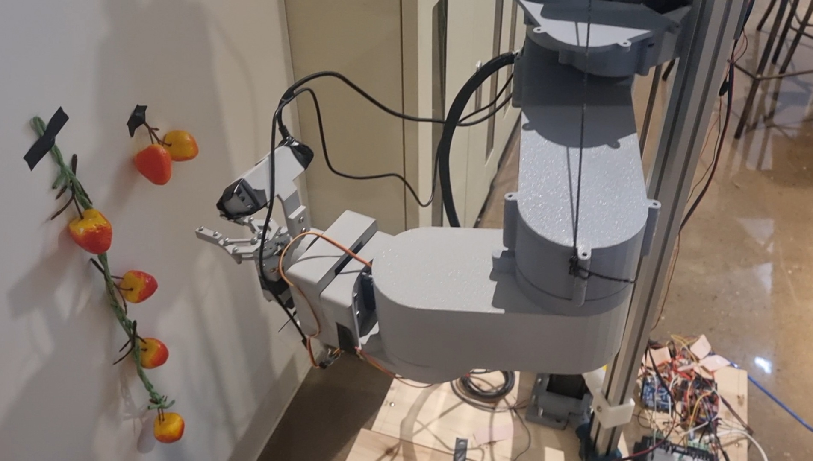

# Berry Good Bot 🍓🤖

딸기 수확을 위한 자율 로봇 시스템 - SCARA 타입 로봇과 시각 서보잉 기술을 결합한 정밀 과일 수확 로봇



-----

## 🌟 프로젝트 개요

본 프로젝트는 2025년 서울대학교 창의설계축전 출품작으로, 2025년 6월부터 8월까지 개발되었습니다. 

Berry Good Bot은 ROS2 Humble 기반의 자율 딸기 수확 로봇으로, SCARA 형태의 5축 로봇 팔과 이중 카메라 시스템을 활용하여 딸기를 정밀하게 수확할 수 있습니다. 시각 서보잉(Visual Servoing) 기술과 Behavior Tree를 통한 체계적인 작업 계획을 통해 안정적이고 효율적인 과일 수확을 실현합니다.

### 주요 특징
- **SCARA 로봇 구조**: Linear Joint(스크류) + 3개의 평면 회전 Joint + Wrist Joint + Gripper
- **이중 카메라 시스템**: RGBD 카메라(RealSense D435i) + RGB 카메라를 활용한 robust한 인식
- **하이브리드 시각 서보잉**: PBVS(Position-Based) + IBVS(Image-Based) 결합
- **모듈화된 아키텍처**: ROS2 Action Server 기반의 확장 가능한 구조
- **Behavior Tree**: 복잡한 작업 시퀀스와 오류 처리를 위한 체계적 접근
-----

## 🏗️ 시스템 아키텍처

### 하드웨어 구성
- **제어 컴퓨터**: NVIDIA Jetson Orin Nano (8GB) + JetPack 6.2
- **로봇 제어**: Arduino UNO (Linear, Wrist, Gripper) + Arduino MEGA (Joint 1,2,3)
- **카메라**: Intel RealSense D435i (상단) + RGB 카메라 (하단)
- **액추에이터**: NEMA17 스텝모터 4개 + MG996R 서보모터 2개

### 소프트웨어 구성

#### 1. 시리얼 통신 브리지 (`berry_serial_bridge`)
- Jetson Orin Nano와 Arduino 간의 시리얼 통신 관리
- 스텝모터의 각가속도/각속도 제어로 진동 최소화
- Homing 동작을 통한 절대 위치 초기화

#### 2. 로봇 모델링 (`berrybot_description`)
- URDF 기반 로봇 모델 정의
- RViz2를 통한 실시간 시각화 및 동기화
- CAD 파일 기반 정확한 기구학 모델링

#### 3. 운동학 제어 (`berry_kinematics_control`)
세 가지 제어 인터페이스 제공:
- **Named Pose**: 미리 정의된 자세(ready, basket, home)로 이동
- **Inverse Kinematics**: IKPY 라이브러리 기반 3차원 위치/자세 제어
- **Servo Twist**: Jacobian 기반 실시간 속도 제어 (Robotics Toolbox 활용)

#### 4. 인식 시스템 (`berry_perception`)

**Rough Approach용 인식**:
- YOLO 기반 딸기 검출 및 confidence 기반 선택
- RGBD 데이터의 outlier 제거 및 depth 평균화
- 3차원 접근점 계산 및 EEF 자세 결정

**Visual Servoing용 인식**:
- RGBD + RGB 카메라의 Ray intersection을 통한 줄기 위치 추정
- HSV 기반 색상 필터링과 YOLO 결과의 IOU 매칭
- Gripper ROI 내 타겟 검증으로 정확도 향상

#### 5. 시각 서보잉 (`berry_perception/visualServoing`)
- **IBVS (Image-Based Visual Servoing)**: RGB 카메라의 image feature error 기반 제어
- **PBVS (Position-Based Visual Servoing)**: 3차원 공간상의 위치 error 기반 제어
- **Hybrid Approach**: IBVS + PBVS twist 조합으로 robust한 서보잉

#### 6. 작업 계획 (Behavior Tree)
- BehaviorTree.CPP 기반 작업 시퀀스 관리
- Hydra를 통한 설정 파일 관리 및 모듈화
- Fallback과 Retry 메커니즘으로 안정성 확보
-----

## 📦 설치 방법

### 개발 환경
- Ubuntu 22.04 (Jetson Orin Nano JetPack 6.2)
- ROS2 Humble
- Python 3.10

### 필수 의존성 설치

1. **ROS2 Humble 설치**
   ```bash
   # ROS2 Humble 설치 가이드 참조
   # https://docs.ros.org/en/humble/Installation/Ubuntu-Install-Debians.html
   ```

2. **BehaviorTree.CPP v3 설치**
   ```bash
   # BehaviorTree.CPP 공식 튜토리얼 참조
   # https://www.behaviortree.dev/docs/intro
   ```

3. **MoveIt2 설치** (현재 빌드 의존성으로 필요, 추후 의존성 제거 예정) 
   ```bash
   # MoveIt2 공식 튜토리얼 참조
   # https://moveit.ai/install-moveit2/source/
   ```


### 설치 및 빌드

1.  ROS2 워크스페이스를 생성하고 `src` 디렉토리로 이동합니다.

    ```bash
    mkdir -p berryGoodBot_ws/src
    cd berryGoodBot_ws/src
    ```

2.  소스 코드를 클론합니다.

    ```bash
    git clone https://github.com/sawo0150/berry-good-bot.git
    ```

3.  워크스페이스 루트로 돌아가서 빌드합니다.

    ```bash
    cd ..
    colcon build
    ```

4.  빌드가 완료되면 터미널에 워크스페이스를 소싱합니다.

    ```bash
    source install/setup.bash
    ```

-----

## ▶️ 실행 방법

프로젝트는 여러 개의 독립적인 ROS2 Action Server와 이를 호출하는 Behavior Tree 클라이언트로 구성됩니다.

### 1\. 핵심 서비스(Action Servers) 실행

각각의 서비스를 위해 **새로운 터미널**을 열고 아래 명령어를 실행하세요. (실행 전 `source install/setup.bash` 필수)

  - **터미널 1: 제어 및 시리얼 브리지 실행**
    이 Lauch 파일은 로봇 모델(URDF)을 RViz2에 띄우고, Jetson과 아두이노 간의 시리얼 통신을 담당하는 `bridge_node`를 실행합니다.

    ```bash
    ros2 launch berry_serial_bridge testkinematicsControl.launch.py
    ```

  - **터미널 2: 인식 시스템 실행**
    이 Launch 파일은 RealSense 카메라 드라이버, 딸기 위치를 3D로 추정하는 `perception_node`, 그리고 근접 서보잉을 위한 `visualServoing` 노드를 실행합니다.

    ```bash
    ros2 launch berry_perception perception_bringup.launch.py
    ```

### 2\. 행동 트리(Behavior Tree) 실행

위의 서버들이 모두 실행된 상태에서, **또 다른 새 터미널**을 열고 아래 명령어를 실행하여 로봇의 실제 동작을 시작합니다.

1.  프로젝트의 루트 디렉토리로 이동합니다.

    ```bash
    cd berryGoodBot_ws/src/berry-good-bot
    ```

2.  `run_bt.py` 스크립트를 실행합니다.

    ```bash
    python3 run_bt.py
    ```

#### 동작 시나리오 변경

`run_bt.py`는 **Hydra** 프레임워크를 사용하여 설정을 관리합니다. 실행할 Behavior Tree 시나리오를 변경하려면 `config/default.yaml` 파일을 수정하세요.

```yaml
# config/default.yaml
defaults:
  - _self_
  - bt: pick_with_loops   # 이 부분을 변경하여 시나리오 선택
  - robot: fake
  - env: sim
```

`bt` 항목에 원하는 YAML 파일 이름을 지정할 수 있습니다.

  - `berry_named_pose_test1`: 예약된 자세(`ready`, `home` 등)로 이동하는 테스트.
  - `rough_approach_test2`: 딸기 인식 후 거친 접근만 테스트.
  - `roughApproach_with_ibvs2`: 거친 접근 후 시각 서보잉까지 수행하여 딸기를 수확하고, 종류(딸기, 오렌지, 사과)에 따라 다른 바구니에 분류.
  - `pick_with_loops`: 필드에 있는 모든 과일을 안정적으로 수확할 때까지 작업을 반복하는 최종 버전.

-----
## 🎥 작동 영상

| 로봇 구동 영상 |
| :---: |
|  |

| RViz2 및 제어 화면 |
| :---: |
|  |


-----

## 🧑‍💻 제작자 정보

  - **권태영**: 로봇 하드웨어 설계 및 제작
  - **김민준**: YOLO-Pose 딥러닝 모델 개발
  - **박상원**: 시스템 통합 및 제어 소프트웨어 개발
